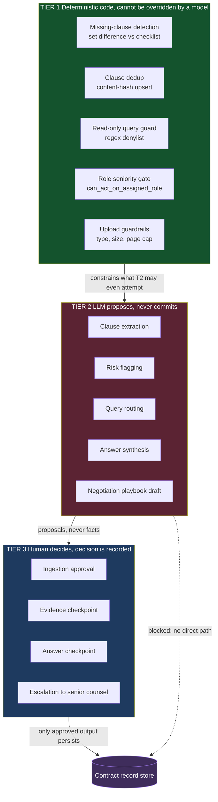
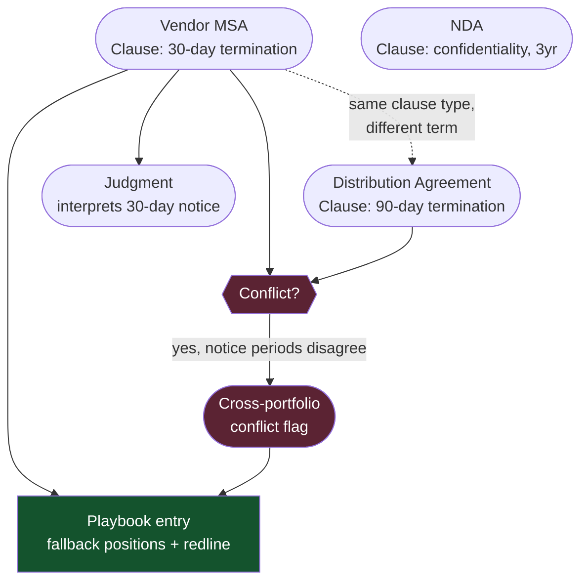
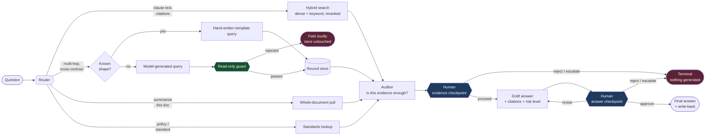
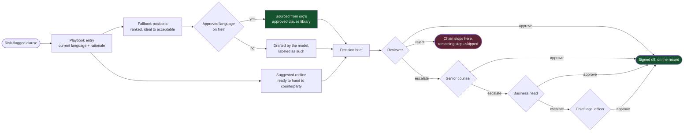
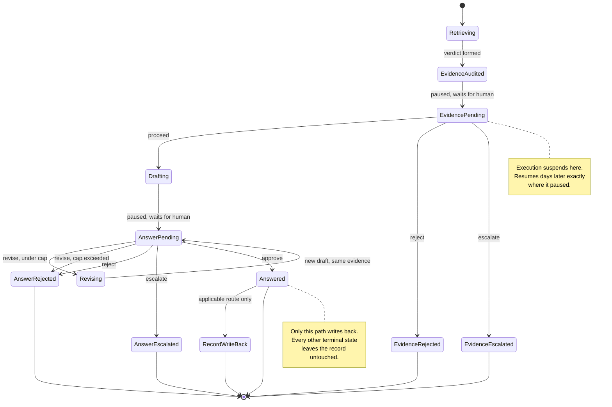
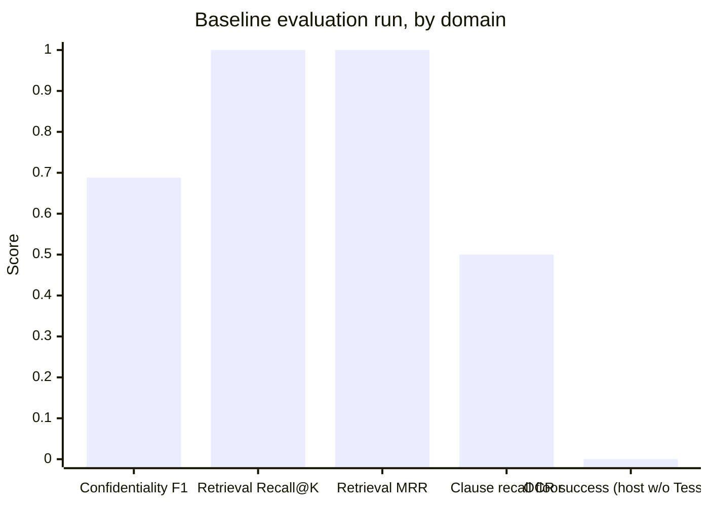

# CounselGraph

[Demonstration Video](https://drive.google.com/file/d/1o5ROZiX2ZzdXzafnaSBss35yR-KEFNO1/view?usp=sharing)

Contract review where the model drafts and a named human decides. Upload a PDF or DOCX,
and the pipeline OCRs what needs OCRing, extracts clauses, flags risk, detects conflicts
across your whole portfolio, and finds what the contract is missing. Ask a question, and
a router chooses between vector search and a connected-record traversal, checks its own
evidence, and drafts an answer. At every point where an LLM output would otherwise become
fact, the pipeline stops and waits for a reviewer.

It does not stop at telling you what is wrong. For every clause a reviewer flags,
CounselGraph builds a negotiation playbook: ranked fallback positions from the ideal ask
down to the minimum acceptable one, and a concrete suggested redline you could hand to
the other side. Reading a contract and grading it is one job. Telling you what to do
about it, and giving a structured, role-gated approval chain to sign off on that plan, is
a second job most tools stop short of. CounselGraph does both.

Nothing is treated as approved until someone with the right seniority has approved it, by
name, on the record.

## The trust boundary

The single design decision everything else follows from: the LLM is a drafting tool, not
an authority. Work is split into three tiers by who is allowed to be wrong.



The dotted line is the point. There is no code path from a model output to the record
store that does not pass through a recorded human decision.

## From a single clause to a connected case file

A contract does not sit alone. The moment a clause is extracted, it is compared against
every clause of the same type already on file, across every other contract in the
portfolio. This is what turns "read this one document" into "know what every document
says."



Two contracts with the same vendor promising two different termination notice periods
would never surface in a single-document review. Here it is a direct comparison, because
every clause already knows every other clause of its type.

## How a question gets an answer

The router does not pick one retrieval strategy for the whole system. It picks per
question, and it also picks how much to weight dense semantic matching versus exact
keyword matching for that specific question.



A revision re-reasons over the exact same evidence with the reviewer's written feedback.
It does not re-retrieve, because the reviewer already approved that evidence at the first
checkpoint. Rounds are capped by default so a genuine disagreement terminates instead of
looping.

## From draft to decision: the negotiation layer

This is the part that goes beyond analysis. Once a clause is flagged, CounselGraph does
not stop at "here is the risk." It builds a working negotiation plan and routes it
through an approval chain that respects seniority.



A rejection or a send-back at any step stops the entire remaining chain rather than
leaving it half-decided. Every step, who decided, when, and why, is on the record.

## Review lifecycle

Every job, ingestion or query, moves through an explicit set of states. Terminal states
are kept distinguishable from each other on purpose: a rejection and an escalation mean
different things to whoever picks the work up next.



Turns ending in rejection or escalation are still written to the transcript for audit,
but a rejected draft never becomes context that shapes the next question.

## Ingestion path

```mermaid
flowchart LR
    U(["PDF / DOCX"]) --> EX["Extract<br/>text + tables"]
    EX --> DT{"low-text<br/>pages?"}
    DT -->|yes| OCR["OCR<br/>only those pages"]
    DT -->|no| CH
    OCR --> CH["Chunk<br/>page + section tracked"]
    CH --> TB["Table extraction<br/>pricing schedules preserved"]
    TB --> PS["Persist<br/>content-hash dedup point"]
    PS --> EM["Embed<br/>into vector index"]
    EM --> CL["Extract clauses"]
    CL --> LK["Link matching clauses<br/>across the portfolio"]
    LK --> CF["Detect conflicts<br/>same-doc + cross-portfolio"]
    CF --> RK["Flag risk<br/>level, category, confidence"]
    RK --> MC["Detect missing clauses<br/>set difference, no model call"]
    MC --> HA{{"Human approval"}}
    HA -->|approve| GW[("Record write")]
    HA -->|"reject / escalate"| NO(["No write"])

    style MC fill:#14532d,color:#ffffff
    style PS fill:#14532d,color:#ffffff
    style HA fill:#1e3a5f,color:#ffffff
```



OCR runs only on pages that actually lack a text layer, so a clean digital PDF never pays
for it. Deduplication happens at persistence via content hash, not by asking a model
whether two clauses look the same.

## What makes it different

| Most contract review tools | CounselGraph |
| --- | --- |
| One retrieval strategy for every question | Router picks strategy and search weighting per question |
| Chunks in a vector store, nothing connected | Clauses linked across every contract in the portfolio |
| Model decides if its own answer is good | An auditor proposes a verdict, a human decides, both are recorded |
| Tells you what is wrong | Tells you what is wrong, then drafts what to do about it |
| Approve or reject | Approve, revise against the same evidence, reject, or escalate by seniority |
| Missing clauses inferred by the model | Set difference against a checklist, deterministic, no model call |
| Generated queries trusted | Read-only guard blocks any mutating query before it reaches storage |
| Single-document review | Cross-portfolio conflict detection across every contract on file |
| "Trust the output" | Append-only audit record per stage, per job, traceable end to end |

## Measured results

Extraction and risk flagging are model calls and are not perfectly deterministic between
runs, so quality is measured against a hand-labeled reference set and reported honestly,
including where a number is unflattering.



- **Confidentiality classification** (deterministic signal scan plus a model call,
  combined by explicit safety rules) scored a macro F1 of **0.688** on a real baseline
  run. The "public" level deliberately scores zero recall by design: the combination
  rule never lets anything default to public without explicit signal, so under-labeling
  a sensitive document is treated as far worse than over-labeling a public one.
- **Retrieval quality**, Recall@K and Mean Reciprocal Rank, both scored a perfect **1.0**
  on a real test, with **zero cross-tenant leakage** verified using the actual embedding
  model against a synthetic multi-tenant collection.
- **Clause recall** is held to a floor of **50 percent average recall** in the
  automated threshold test, a regression tripwire rather than a ceiling. It needs a live
  model key and skips itself cleanly without one.
- **OCR page-success** genuinely scored **0 percent** in one baseline run because
  Tesseract and Poppler were not installed on that host at the time. This is included
  deliberately: the evaluation framework reports a metric it cannot honestly compute as
  failed, never invented.
- **RAGAS** (faithfulness, answer relevancy, context precision, context recall) scores
  every logged chat turn that actually produced an answer, run in an isolated
  environment so its dependency chain never collides with the main app's. Turns that
  ended in a rejection or escalation before any answer existed are excluded, since these
  metrics are undefined when nothing was generated to score.
- Underneath all of it, a suite of **139-plus automated tests** covers authentication,
  role-seniority enforcement, confidentiality access control, standards resolution,
  risk-flag routing, chat-memory scoping, and approval-chain logic, verifying the
  deterministic scaffolding behaves exactly as designed on every run.

```bash
python tests/eval/run_eval.py                              # per-document breakdown
pytest tests/eval/test_eval_thresholds.py                  # pass/fail summary
.venv-ragas/Scripts/python.exe scripts/run_ragas_eval.py   # RAGAS on logged turns
```

## Stack

| Layer | Technology | What it does here |
| --- | --- | --- |
| Orchestration | LangGraph | Pauses execution at a human checkpoint and resumes exactly where it stopped, potentially days later |
| Graph store | Neo4j 5 | Holds clauses, parties, judgments, and their connections; makes cross-contract lookups a direct traversal |
| Vector store | Chroma, embedded | Semantic search over document chunks, one collection per document |
| Operational data | PostgreSQL 16, SQLAlchemy | Org profiles, documents, review actions, chat history, evaluation runs |
| Object storage | MinIO, S3-compatible | Uploaded document files, local-disk fallback when unset |
| Retrieval | Dense + keyword search, reranked | Blends semantic and exact-term matching, weighted per question |
| Parsing | pdfplumber, python-docx, Tesseract | Text and table extraction, OCR only where a text layer is genuinely absent |
| API | FastAPI, signed session cookies | Fixed reviewer roster from environment, no open signup |
| Language model | Gemini | Extraction, routing, synthesis, revision, playbook drafting |

## Login and access

There is no signup and no open user database. The reviewer roster is fixed at deploy
time, either as a `REVIEWERS` JSON list or numbered `REVIEWER_N_*` environment
variables, each entry carrying a username, password, and role (`reviewer`,
`senior_counsel`, `business_head`, `clo`, or `admin`). Sign in at `/ui` with whichever
account was configured for that deployment. A single Gemini API key
(`GEMINI_API_KEY` in `.env`, free tier available) drives every model call; without one
the app still runs and serves the interface, but any action that needs the model will
fail until a key is set.

## Layout

```
src/counsel_graph/
  agents/       router, prompts, query orchestration, RAGAS logging
  api/          FastAPI app, session auth, role seniority, static UI
  graphrag/     extraction, risk, standards, conflicts, playbook, record store
  ingestion/    PDF/DOCX to OCR to chunk pipeline
  retrieval/    hybrid search, contract metadata
  db/           models, repository, content-hash dedup
  storage/      object store client with disk fallback
scripts/        seed_db, run_evaluation, run_ragas_eval
tests/          unit suite, plus tests/eval/ labeled set and thresholds
data/           sample contracts, clause library, policy refs, risk taxonomy
```

## Running it

```bash
cp .env.example .env
# set GEMINI_API_KEY, replace every placeholder credential and SESSION_SECRET

docker compose up -d --build
docker compose exec api python scripts/seed_db.py   # first bring-up, or after a volume reset
```

Open `http://localhost:8000/ui`. Services come up on 8000 (API and UI), 5432 (Postgres),
7474 and 7687 (Neo4j browser and Bolt), 9000 and 9001 (MinIO API and console).

Natively, once dependencies are installed and Neo4j is reachable:

```bash
pip install -e .
uvicorn counsel_graph.api.main:app --reload --port 8000
```

Requires Python 3.10+, a Gemini API key
([free tier](https://aistudio.google.com/apikey)), and a reachable Neo4j instance.
