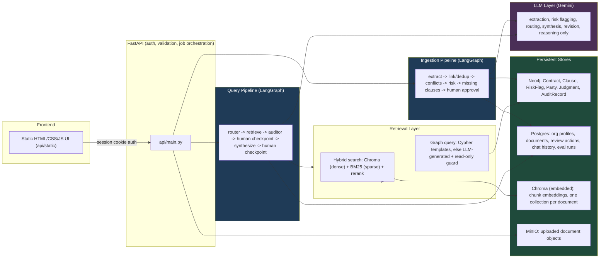
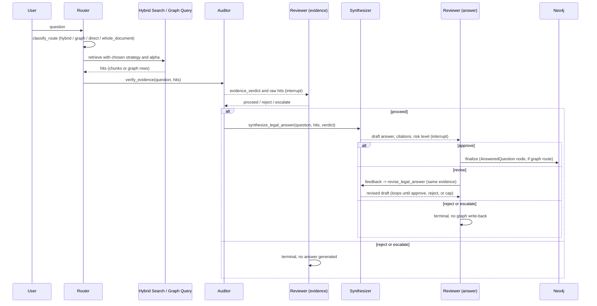

# CounselGraph

A governed, evidence-backed legal contract review platform built around Graph-RAG and
mandatory human review. You upload a PDF or DOCX contract, the pipeline extracts clauses,
flags risk, detects conflicts and missing clauses, builds a graph of parties and
precedent, and stops for a named reviewer's decision at every point that matters. When
you ask a question, a router picks hybrid vector/keyword search or a graph query,
generates a draft answer, and again stops for human approval before anything counts as
final. Nothing an LLM produces, an extracted clause, a risk flag, a drafted answer, is
ever written back to the graph as fact until a reviewer has explicitly approved it.

The core loop, enforced end to end:

```
UPLOAD -> OCR (if needed) -> CHUNK -> EXTRACT CLAUSES -> LINK/DEDUP -> DETECT CONFLICTS ->
FLAG RISK -> DETECT MISSING CLAUSES -> HUMAN APPROVAL -> GRAPH WRITE

QUESTION -> ROUTE -> RETRIEVE (hybrid or graph) -> VERIFY EVIDENCE -> HUMAN CHECKPOINT ->
SYNTHESIZE ANSWER -> HUMAN CHECKPOINT (approve / revise / reject / escalate) -> FINALIZE
```

## Key features

### Dual LangGraph pipelines, both stopping for human review
Two separate `StateGraph`s share the same Neo4j and Chroma stores: an ingestion graph
(extraction through approval) and a query graph (retrieval through answer approval).
Both use `interrupt()` to pause mid-execution and `Command(resume=...)` to continue,
so a review can happen minutes or days later without the process staying alive in
between. Every pause hands back a structured JSON payload describing exactly what the
reviewer is deciding on.

### Two-checkpoint query pipeline with a revision loop
A query never gets a one-shot answer. The evidence a router retrieves is checked by an
LLM auditor and then a human, before any answer is generated at all. Once drafted, a
second reviewer can approve, ask for a revision (the model reasons over the same
evidence again with the reviewer's written feedback, no new retrieval), reject outright,
or escalate to senior review. Revision rounds are capped (`max_answer_revisions`, default
3) so a disagreement can't loop forever.

### Router with per-query retrieval strategy
`classify_route()` picks hybrid search, a graph query, a whole-document pull, or a direct
standards lookup based on the question itself, and also chooses the dense/sparse blend
weight (`alpha`) for hybrid search on a per-query basis, rather than using one fixed
retrieval strategy for every question.

### Graph queries: templates first, generated Cypher only as a fallback
Common multi-hop question shapes (same clause across contracts, judgment history for a
clause type, vendor-plus-clause-plus-precedent chains) are matched against hand-written
Cypher templates first. Only unmatched questions fall through to LLM-generated Cypher,
and every generated query is checked against a regex denylist (`is_read_only_cypher`)
before it ever reaches Neo4j, rejecting `CREATE`, `MERGE`, `DELETE`, `SET`, `REMOVE`,
`DROP`, and APOC/`LOAD CSV` calls. A bad generation can fail to answer the question; it
cannot mutate the graph.

### Deterministic checks stay deterministic
Missing-clause detection is a set-difference against a per-contract-type checklist, not
another LLM call. Clause deduplication is a content-hash upsert, not an LLM judgment
call. Anything that can be computed correctly without an LLM is computed without one, so
the model is only ever asked to do the part that actually requires reasoning over text.

### Risk-based approval routing by role seniority
Risk flags are assigned a reviewer role, and `can_act_on_assigned_role()` enforces a
seniority ordering (`admin` and `senior_counsel` outrank a plain `reviewer`, with
`business_head`/`clo` as approval-chain fallback roles) so a flag routed to senior review
can't be quietly approved by a junior account. The reviewer roster itself is configurable
per deployment (`REVIEWERS` JSON, or numbered `REVIEWER_N_*` env vars), not hardcoded to
one account.

### Cross-portfolio conflict detection
Clauses aren't only checked against the contract they came from. `find_conflicting_clause_pairs`
compares clauses of the same type across every contract in the portfolio (for example
contradictory termination notice periods between two agreements with the same vendor),
surfacing conflicts a single-document review would never catch.

### Standards resolution with real scope precedence
When a question or extracted clause names a known clause type, `resolve_standards()`
resolves the applicable standard across a real scope hierarchy (customer, business unit,
jurisdiction, org profile) rather than a single global default, and returns which scope
actually matched so the answer can cite where the standard came from.

### OCR and table-aware ingestion, with real anomaly handling
Low-text pages are detected and OCR'd with Tesseract only where needed, so a normal
text-layer PDF never pays the OCR cost. Pricing tables are extracted alongside clause
text via `pdfplumber`. The eval suite includes dedicated anomaly documents: a scanned
no-text-layer page, a repeated-clause document, and an embedded pricing schedule, so
recall is measured against real edge cases, not only clean inputs.

### Prompt injection containment
Any text sourced from an uploaded document or a user question is wrapped with
`wrap_untrusted()` before reaching the LLM, tagging it as data and explicitly instructing
the model to treat anything inside it as content, never as an instruction to follow.

### Full audit trail, not just a final answer
Every stage of every ingestion or query job writes an append-only `AuditRecord`
(job id, actor, action, detail, timestamp), retrievable by job id. Reviewer decisions
(approve, reject, revise, escalate) are stored with the reviewer's name, a timestamp, and
their comments, so any final answer or approved clause can be traced back through every
step that produced it.

### Per-document conversational memory, correctly scoped
Chat history is scoped strictly by document id, so switching documents can never leak
context from one contract into a question about another. Only turns that reached
`answered` status are fed back as memory. A rejected or escalated draft is recorded for
audit but never treated as established context for the next question.

## Architecture



**The rule that matters most:** the LLM extracts, classifies, routes, and drafts. It
never gets to decide that its own output is correct. Missing-clause detection,
deduplication, the read-only Cypher guard, and risk-routing seniority are all plain code,
not model judgment. Nothing reaches Neo4j as an approved fact without a named reviewer's
decision recorded against it first.

## Query pipeline in detail



## Evaluation approach

Clause extraction and risk flagging are LLM-based and not perfectly deterministic
between runs, so this is measured against a hand-labeled reference set rather than
assumed correct.

- **Reference set**: `tests/eval/labeled_eval_set.json` hand-labels expected clause
  types, expected high-risk clause types, and expected missing clauses for every sample
  contract in `data/sample_contracts/`, including documents built specifically to
  exercise anomalies (scanned no-text-layer page, duplicate clause requiring dedup,
  embedded pricing table, cross-portfolio conflicting clauses).
- **Metrics computed**: clause recall (found expected clause types over all expected),
  risk-flag precision (correct high-risk flags over all high-risk flags raised),
  missing-clause detection accuracy (exact match against the expected set), a
  dedup check (raw extracted count vs. unique content hashes), a table-extraction count
  check, and a cross-portfolio conflict-detection check.
- **Correctness distinguished from "nothing to find"**: a scanned page with OCR
  intentionally skipped is scored as recall not applicable, not zero, since finding
  nothing is the correct outcome for that code path, not a failure. This keeps the
  aggregate honest instead of inflating or deflating it with a code path that was never
  supposed to extract anything.
- **CI-friendly threshold test**: `tests/eval/test_eval_thresholds.py` runs the same
  pipeline against a loose quality floor (average recall at or above 50 percent) rather
  than asserting exact matches, appropriate for a model-based extraction step. It
  requires a live Gemini API key and is skipped automatically if one is not set, so it
  never blocks a key-less test run.
- **RAGAS chat evaluation**: every chat turn is logged (`agents/ragas_logging.py`) with
  its question, answer, and retrieved contexts. `scripts/run_ragas_eval.py`, run in an
  isolated `.venv-ragas` environment to avoid a dependency conflict with the main app's
  LangGraph stack, scores logged turns on faithfulness, answer relevancy, context
  precision, and context recall. Turns with no generated answer (evidence rejected or
  escalated) are skipped rather than scored as zero, since these metrics are undefined
  for a turn where no answer was produced.
- **Operations dashboard**: aggregate throughput, approval outcomes, and risk-category
  counts across every job processed so far are visible in the running app, not only in
  an offline script, so evaluation reflects real usage, not only the fixed sample set.

Run it yourself:

```bash
python tests/eval/run_eval.py                    # full breakdown, per document
pytest tests/eval/test_eval_thresholds.py        # CI-friendly pass/fail summary
.venv-ragas/Scripts/python.exe scripts/run_ragas_eval.py   # RAGAS metrics on logged chat turns
```

## Technology

| Layer | Technology |
| --- | --- |
| Backend API | FastAPI, session-cookie auth (`itsdangerous`), Pydantic |
| Orchestration | LangGraph (`StateGraph`, `interrupt` / `Command(resume=...)`) |
| Vector store | Chroma (embedded, on-disk `PersistentClient`) |
| Graph store | Neo4j 5 Community |
| Operational data | PostgreSQL 16 (SQLAlchemy), object storage on MinIO (S3-compatible) |
| Retrieval | Hybrid dense plus BM25 search with reranking, sentence-transformers embeddings |
| Document parsing | pdfplumber (PDF text and tables), python-docx (DOCX), Tesseract OCR (scanned pages) |
| LLM | Gemini API |
| Evaluation | Hand-labeled eval set, RAGAS (faithfulness, relevancy, context precision and recall) |
| Containers | Docker Compose (Postgres, Neo4j, MinIO, API) |

## Repository map

```
CounselGraph/
├── src/counsel_graph/
│   ├── agents/         router and specialist agents, prompts, the query LangGraph
│   ├── api/             FastAPI app, auth and session handling, static frontend
│   ├── graphrag/         Neo4j-backed extraction, risk flagging, standards, conflicts
│   ├── ingestion/        PDF/DOCX -> OCR -> chunking pipeline
│   ├── retrieval/        hybrid (vector and BM25) search, contract metadata
│   ├── db/               SQLAlchemy models, repository, dedup, session handling
│   ├── storage/          object store client (MinIO with local disk fallback)
│   ├── llm_client.py, config.py, guardrails.py, resources.py
├── scripts/              seed_db.py, run_evaluation.py, run_ragas_eval.py
├── tests/                unit tests, plus tests/eval/ for the labeled eval set
├── data/
│   ├── sample_contracts/     sample documents, including anomaly cases, for eval
│   ├── clause_library/       approved reference clause language
│   ├── policy_references/    internal policy summaries
│   └── risk_taxonomy.csv     risk categories, severities, recommended actions
├── docs/                 architecture, API reference, security notes
├── deployment/           environment setup (Docker Compose, native, cloud notes)
├── docker-compose.yml
└── Dockerfile
```

## Requirements

- Docker and Docker Compose, or Python 3.10+ for a native setup
- A Gemini API key (free tier available at
  [aistudio.google.com/apikey](https://aistudio.google.com/apikey)) for extraction, risk
  flagging, routing, and answer synthesis
- A Neo4j instance (a free hosted instance works, or the bundled Docker Compose
  container)

## Deployment (Docker Compose)

```bash
cp .env.example .env
# fill in GEMINI_API_KEY and change every placeholder admin, session, and db value

docker compose up -d --build
docker compose exec api python scripts/seed_db.py   # one-time, after first bring-up or a volume reset
```

Then open `http://localhost:8000/ui`. See
[`deployment/environment_setup.md`](deployment/environment_setup.md) for the full
breakdown, including the native-Python and cloud-deployment alternatives.

## Running natively

```bash
uvicorn counsel_graph.api.main:app --reload --port 8000
```

Open `http://localhost:8000/ui`, sign in with your configured reviewer credentials.
There is no signup and no open user database; the reviewer roster is fixed at deploy
time via environment variables.

## Documentation

- [`docs/architecture.md`](docs/architecture.md): how the ingestion and query pipelines
  work end to end.
- [`docs/api_documentation.md`](docs/api_documentation.md): every endpoint, request and
  response shapes, error cases.
- [`docs/security_notes.md`](docs/security_notes.md): auth, secrets, prompt injection
  defense, and what is explicitly out of scope.
- [`deployment/environment_setup.md`](deployment/environment_setup.md): Docker Compose
  deployment, native setup, and cloud-deployment notes.

## Tests

```bash
pytest
```

Runs the unit test suite plus `tests/eval/test_eval_thresholds.py`. The eval test needs a
live Gemini API key since it makes real LLM calls; it is skipped automatically if one is
not set.

## Notes

- All model outputs are treated as drafts until a named reviewer approves them; nothing
  is written back to the graph unless it was explicitly approved.
- Clause extraction and risk assessment are LLM-based and are evaluated as such, against
  a hand-labeled reference set with a quality floor, not asserted as exactly correct.
- Secrets are read from environment variables only and are never committed. See
  [`docs/security_notes.md`](docs/security_notes.md) for details.
