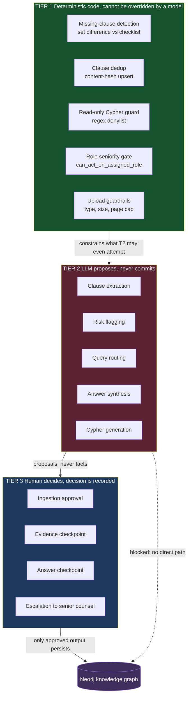
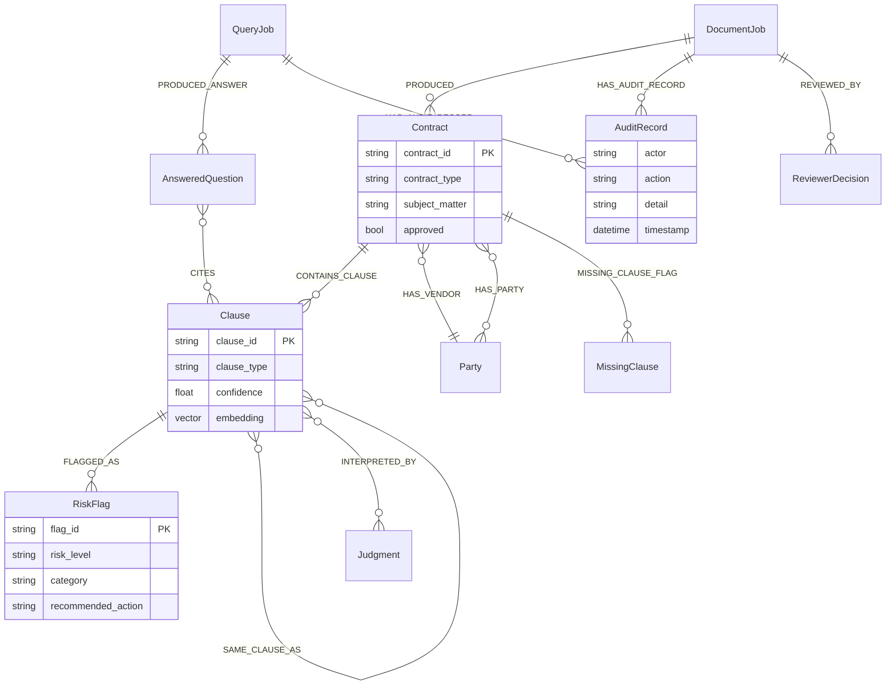
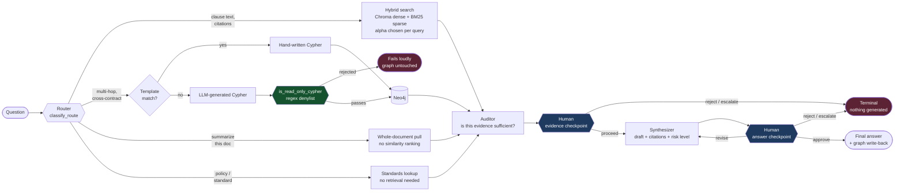
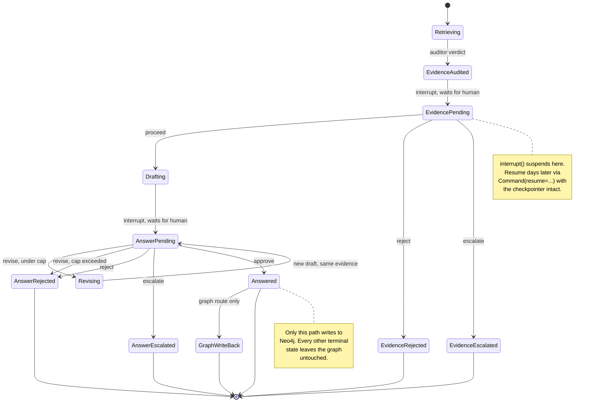

# CounselGraph

Contract review where the model drafts and a named human decides. Upload a PDF or DOCX,
and the pipeline OCRs what needs OCRing, extracts clauses, flags risk, detects conflicts
across your whole portfolio, and finds what the contract is missing. Ask a question, and
a router chooses between vector search and a graph traversal, checks its own evidence,
and drafts an answer. At every point where an LLM output would otherwise become fact, the
pipeline stops and waits for a reviewer.

Nothing reaches the knowledge graph as approved until someone with the right seniority
has approved it, by name, on the record.

## The trust boundary

The single design decision everything else follows from: the LLM is a drafting tool, not
an authority. Work is split into three tiers by who is allowed to be wrong.



The dotted line is the point. There is no code path from a model output to the graph that
does not pass through a recorded human decision.

## What gets built: the knowledge graph

Ingestion does not produce a pile of text chunks. It produces a connected graph, which is
what makes cross-contract questions answerable at all.



`SAME_CLAUSE_AS` is the edge that earns the graph its place. Once a clause is linked to
its counterpart in another agreement, "has anyone signed a contradictory termination
notice period with this vendor" stops being a full-text search problem and becomes a
two-hop traversal.

## How a question is answered

The router does not pick one retrieval strategy for the whole system. It picks per
question, and it also picks how much to weight dense versus sparse matching for that
specific question.



Note the revise edge looping back into the synthesizer. A revision re-reasons over the
same evidence with the reviewer's written feedback. It does not re-retrieve, because the
reviewer already approved that evidence at the first checkpoint. Rounds are capped at
`max_answer_revisions` (default 3) so a disagreement terminates instead of looping.

## Review lifecycle

Every job, ingestion or query, moves through an explicit state machine. Terminal states
are distinguishable from each other on purpose: a rejection and an escalation mean
different things to whoever picks the work up next.



Turns ending in rejection or escalation are still written to the chat transcript for
audit, but `start_job_node` only feeds `answered` turns back as conversational memory, so
a rejected draft never becomes context that shapes the next question.

## Ingestion path

```mermaid
flowchart LR
    U(["PDF / DOCX"]) --> EX["extract<br/>pdfplumber, python-docx"]
    EX --> DT{"low-text<br/>pages?"}
    DT -->|yes| OCR["ocr<br/>Tesseract, only those pages"]
    DT -->|no| CH
    OCR --> CH["chunk<br/>sliding window, page + section tracked"]
    CH --> TB["table<br/>pricing schedules preserved"]
    TB --> PS["persist<br/>content-hash upsert, dedup point"]
    PS --> EM["embed_store<br/>sentence-transformers into Chroma"]
    EM --> CL["extract_clauses<br/>one LLM call per chunk"]
    CL --> LK["link SAME_CLAUSE_AS<br/>vector match vs existing graph"]
    LK --> CF["detect_conflicts<br/>+ cross-portfolio pairs"]
    CF --> RK["flag_risks<br/>level, category, action, confidence"]
    RK --> MC["detect_missing_clauses<br/>set difference, no LLM"]
    MC --> HA{{"Human approval"}}
    HA -->|approve| GW[("Graph write")]
    HA -->|"reject / escalate"| NO(["No write"])

    style MC fill:#14532d,color:#ffffff
    style PS fill:#14532d,color:#ffffff
    style HA fill:#1e3a5f,color:#ffffff
```



OCR runs only on pages that actually lack a text layer, so a clean digital PDF never pays
for it. Deduplication happens at persistence via content hash, not by asking a model
whether two clauses look the same.

## What makes it different

| Most contract RAG | CounselGraph |
| --- | --- |
| One retrieval strategy for every question | Router picks strategy and dense/sparse weight per question |
| Chunks in a vector store | Connected graph, so `SAME_CLAUSE_AS` makes cross-contract questions two-hop traversals |
| Model decides if its answer is good | LLM auditor proposes a verdict, a human decides, both are recorded |
| Approve or reject | Approve, revise against the same evidence, reject, or escalate by role seniority |
| Missing clauses inferred by the model | Set difference against a per-contract-type checklist, deterministic |
| Generated Cypher trusted | Regex denylist blocks any mutating query before it reaches Neo4j |
| Single-document review | Cross-portfolio conflict detection across every contract in the graph |
| "Trust the output" | Append-only audit record per stage, per job, traceable end to end |

## Evaluation

Extraction and risk flagging are LLM-based and not deterministic between runs, so they
are measured, not assumed.

**Hand-labeled reference set.** `tests/eval/labeled_eval_set.json` labels the expected
clause types, expected high-risk clause types, and expected missing clauses for every
document in `data/sample_contracts/`, deliberately including adversarial cases:

| Case | What it proves |
| --- | --- |
| Scanned page, no text layer | OCR recovery path, and that skipping OCR yields nothing rather than garbage |
| Repeated clause in one document | Content-hash dedup collapses duplicates at persistence |
| Embedded pricing schedule | Table extraction count matches the document |
| Two contracts, contradictory notice periods | Cross-portfolio conflict detection fires on the right clause type |
| Unusual governing law | Extraction does not silently normalize an atypical jurisdiction away |

**Metrics.** Clause recall (expected types found over expected total), risk precision
(correct high-risk flags over flags raised), missing-clause accuracy (exact set match),
plus per-anomaly checks: unique content hashes versus raw extraction count, table count,
and conflict-pair detection.

**Honest scoring of "nothing to find."** A scanned document with OCR intentionally
skipped is scored as not applicable, not zero. Finding nothing is the correct behavior
for that path, and counting it as a failure would understate real quality just as badly
as excluding a genuine miss would overstate it.

**Quality floor, not exact match.** `tests/eval/test_eval_thresholds.py` asserts average
recall stays at or above 50 percent rather than asserting exact output, which is the
appropriate bar for a model-based step. It needs a live Gemini key and skips itself
cleanly without one, so a key-less `pytest` run never fails on it.

**RAGAS on real traffic.** Every chat turn logs its question, answer, and retrieved
contexts. `scripts/run_ragas_eval.py` scores them on faithfulness, answer relevancy,
context precision, and context recall. It runs in an isolated `.venv-ragas` because
current RAGAS releases import a `langchain_community` submodule that the main app's
LangGraph stack has moved past, so the two dependency trees never share a process. Turns
that produced no answer are skipped, since these metrics are undefined when there is
nothing to score.

```bash
python tests/eval/run_eval.py                              # per-document breakdown
pytest tests/eval/test_eval_thresholds.py                  # pass/fail summary
.venv-ragas/Scripts/python.exe scripts/run_ragas_eval.py   # RAGAS on logged turns
```

## Stack

| Layer | Choice | Why this one |
| --- | --- | --- |
| Orchestration | LangGraph `StateGraph` | `interrupt()` suspends mid-graph and `Command(resume=...)` resumes days later, so a pending review costs nothing while it waits |
| Graph store | Neo4j 5 | Clause-to-clause and clause-to-judgment traversal is the whole point; this is not a join a relational schema does well |
| Vector store | Chroma, embedded `PersistentClient` | On-disk, no separate service, mounted as a named volume so it survives container recreation |
| Operational data | PostgreSQL 16, SQLAlchemy | Org profiles, documents, review actions, chat history, eval runs |
| Object storage | MinIO, S3-compatible | Uploaded documents, with a local-disk fallback when unset |
| Retrieval | Chroma dense + BM25 sparse, reranked | Legal text needs exact-term matching that pure dense retrieval loses |
| Parsing | pdfplumber, python-docx, Tesseract | Tables preserved, OCR only where a text layer is genuinely absent |
| API | FastAPI, signed session cookies | Fixed reviewer roster from environment, no open signup |
| LLM | Gemini | Extraction, routing, synthesis, revision |

## Layout

```
src/counsel_graph/
  agents/       router, prompts, query LangGraph, RAGAS logging
  api/          FastAPI app, session auth, role seniority, static UI
  graphrag/     extraction, risk, standards, conflicts, Neo4j store
  ingestion/    PDF/DOCX to OCR to chunk pipeline
  retrieval/    hybrid search, contract metadata
  db/           models, repository, content-hash dedup
  storage/      object store client with disk fallback
scripts/        seed_db, run_evaluation, run_ragas_eval
tests/          unit suite, plus tests/eval/ labeled set and thresholds
data/           sample contracts, clause library, policy refs, risk taxonomy
docs/           architecture, API reference, security notes
```

## Running it

```bash
cp .env.example .env
# set GEMINI_API_KEY, replace every placeholder credential and SESSION_SECRET

docker compose up -d --build
docker compose exec api python scripts/seed_db.py   # first bring-up, or after a volume reset
```

Open `http://localhost:8000/ui`. Services come up on 8000 (API and UI), 5432 (Postgres),
7474 and 7687 (Neo4j browser and Bolt), 9000 and 9001 (MinIO API and console).

Natively, once dependencies are installed and Neo4j is reachable:

```bash
pip install -e .
uvicorn counsel_graph.api.main:app --reload --port 8000
```

Requires Python 3.10+, a Gemini API key
([free tier](https://aistudio.google.com/apikey)), and a reachable Neo4j instance.

## Documentation

- [`docs/architecture.md`](docs/architecture.md), pipeline internals end to end
- [`docs/api_documentation.md`](docs/api_documentation.md), endpoints and error cases
- [`docs/security_notes.md`](docs/security_notes.md), auth, prompt injection defense, and
  what is deliberately out of scope
- [`deployment/environment_setup.md`](deployment/environment_setup.md), Docker Compose,
  native, and cloud notes

## Known limits

Stated plainly rather than buried, because a review tool that overstates its own
reliability is worse than one that does not exist.

- Clause extraction is a model call and varies between runs. The eval floor is 50 percent
  average recall, which is a regression tripwire, not a claim of production accuracy.
- Prompt-injection wrapping (`wrap_untrusted`) reduces the odds a hostile contract
  hijacks a prompt. It is a mitigation, not a guarantee.
- The rate limiter is in-memory and per-process, so it resets on restart and does not
  coordinate across workers. A multi-worker deployment needs a shared store.
- Uploaded files and the Chroma store are unencrypted on disk.
- The LangGraph checkpointer defaults to in-memory, which is single-process only. Set
  `CHECKPOINTER_BACKEND` to Postgres or Redis for anything beyond local use.
